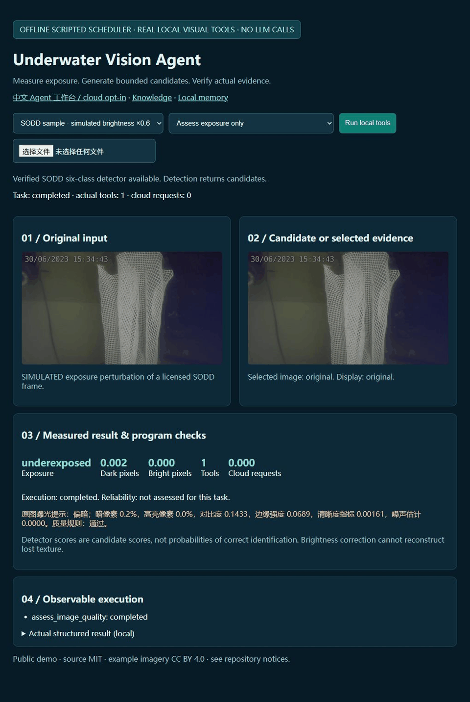
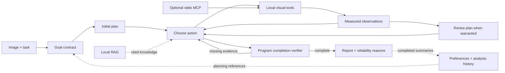

# Underwater Vision Agent

**Local underwater exposure analysis and bounded correction, with evidence-checked object recognition.**

[中文操作指南](docs/QUICK_START_ZH.md) · [Evaluation details](docs/EVALUATION.md) · [MIT](LICENSE) · [Data attribution](THIRD_PARTY_NOTICES.md)



*The GIF uses a scripted scheduler and the actual SODD detector. Brightness ×0.6 is
a simulated perturbation. An “unreliable” conclusion is intentionally retained.
No cloud LLM was called to make this recording.*

## Architecture



The **native runtime is the default**. An optional LangGraph runtime exposes the
same stages as graph nodes. An immutable goal contract, tool prerequisites,
bounded candidates and a program verifier constrain both runtimes. Measurements,
boxes and reliability states come from executed tools. RAG and historical memory
cannot substitute for evidence from the current image.

## Evidence, with scope

These are separate historical experiments, **not one current-version success
score**. Full reports retain failures and denominators.

| Experiment | Result | Scope |
|---|---:|---|
| [Legacy formal Agent Eval](FORMAL_EVALUATION_RESULTS.md) | **59/60 complete (98.3%)** | 0.2.3 behavior; 20 held-out tasks ×3 runs; 78 turns |
| [Adaptive visual development demo](ADAPTIVE_EVALUATION_RESULTS.md) | **3/6 complete**; fixed workflow **6/6** | 0.3.0; three inputs ×2; includes simulated perturbations |
| [Frozen-corpus RAG](RAG_RESULTS.md) | Delivered Recall@3: **35.0% TF-IDF → 47.5% Hybrid** | 0.5.0 C1; 40 answerable +10 no-answer held-out questions |
| [MCP protocol parity](MCP_RESULTS.md) | **3 tools; 9/9 direct-call checks** | 0.5.3; actual stdio client, not an accuracy benchmark |

Repeated runs are not independent tasks. Labels were not externally reviewed by
humans; same-model-family audits are provisional. Retrieval results do not measure
LLM answer quality or detector accuracy. The public knowledge corpus has a new
identity and defaults to TF-IDF; the historical RAG scores belong to frozen C1.

## Quick Start — no key, no weights, CPU

Tested with **Python 3.11**. On Windows PowerShell:

```powershell
git clone https://github.com/sadbrand11-blip/underwater-vision-agent.git
cd underwater-vision-agent
python -m venv D:\CodexData\optical_agent\public\venv
D:\CodexData\optical_agent\public\venv\Scripts\python.exe -m pip install -r requirements-demo.txt
D:\CodexData\optical_agent\public\venv\Scripts\python.exe run_demo.py
```

Open **http://127.0.0.1:7860/showcase**. Choose **Assess exposure only** or
**Correct exposure only**, then click **Run local tools**. A licensed sample is
included; you can also upload your own image. The default scheduler is explicitly
offline and scripted. Missing detector weights mean **detection unavailable**, not
“no objects.” Use `--port 7861` if another local instance uses 7860.

Downloads, weights, logs and memory default to `D:\CodexData\optical_agent\public`.
For other platforms, set `OPTICAL_AGENT_DATA_ROOT` to your data directory **before
launching**, create a normal venv there, and use its Python executable.

### Optional actual object detection

```powershell
D:\CodexData\optical_agent\public\venv\Scripts\python.exe -m pip install -r requirements-detector.txt --index-url https://download.pytorch.org/whl/cpu
D:\CodexData\optical_agent\public\venv\Scripts\python.exe run_demo.py --with-detector
```

The launcher downloads the MIT checkpoint from the public
[Release](https://github.com/sadbrand11-blip/underwater-vision-agent/releases/tag/v0.5.3-public.1),
checks its size and SHA256, and loads it on CPU. Six supported classes:
`propeller`, `pipe_type2`, `red_fin`, `net`, `qr_codes`, `pipe`.
The pipe preset filters to `pipe` + `pipe_type2`. Model output remains candidate
evidence; the program makes the reliability decision.

### Optional cloud and interfaces

The Chinese `/agent` workbench supports free-text tasks. Copy `.env.example` to
`.env`, configure the local key, and explicitly select cloud mode there. Never
commit the populated file. Cloud scheduling sends text and structured results;
image processing stays local. It may incur provider charges.

See [optional modes](docs/OPTIONAL_MODES.md) for local Embedding/Hybrid,
LangGraph and the three-tool MCP server. They are not required for Quick Start.

## Limits and reproducibility

- Enhancement cannot establish the true texture of a fully clipped region.
- Candidate scores and more boxes do not establish improved recognition accuracy.
- Single-frame checks are not cross-exposure consensus or safety certification.
- The default model's domain is the SODD pool dataset; open-water transfer is unproven.
- Robot detection and other experimental weights are not part of this public release.
- No camera or human review queue is required. Failed quality is a valid reported result.

[Public verification](docs/PUBLIC_VERIFICATION.md) documents the clean-environment
checks and sanitized export. [Version history](docs/VERSION_HISTORY.md) preserves
the original development narrative; historical scripts may require external data.
The lightweight demo is the supported public entry point.
