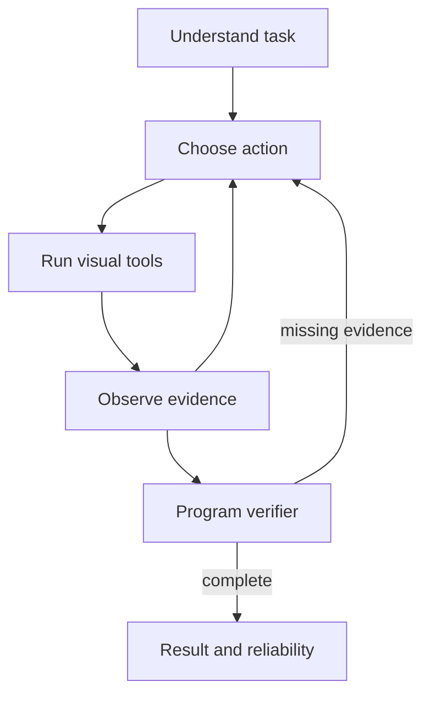

# Underwater Vision Agent

**Local underwater exposure assessment, bounded correction and evidence-checked object recognition.**

[中文指南](docs/QUICK_START_ZH.md) · [Architecture](docs/ARCHITECTURE.md) · [MIT](LICENSE) · [Attribution](THIRD_PARTY_NOTICES.md)


*Offline scripted scheduler, actual SODD detector. The dark input uses simulated brightness ×0.6. Unreliable results are retained; this recording made no cloud LLM calls.*

## Quick Start

Python 3.11, CPU. The default demo needs no API key or detector weights. In Windows PowerShell:

```powershell
git clone https://github.com/sadbrand11-blip/underwater-vision-agent.git
cd underwater-vision-agent
python -m venv D:\CodexData\optical_agent\public\venv
$agentPython = "D:\CodexData\optical_agent\public\venv\Scripts\python.exe"
& $agentPython -m pip install -r requirements-demo.txt
& $agentPython run_demo.py
```

Open **http://127.0.0.1:7860/showcase**, choose exposure assessment or correction, and run the local tools. Use the included licensed sample or upload an image. Missing detection resources are reported as unavailable. Use `--port 7861` when 7860 is occupied.

For actual recognition, install the optional CPU detector and start with `--with-detector`; the launcher verifies the released checkpoint's SHA256. See the [Chinese guide](docs/QUICK_START_ZH.md) for exact commands, supported classes and other platforms.

The `/agent` workbench supports image tasks, follow-up questions and expandable evidence. Its offline mode supports example tasks; free-text cloud scheduling requires a locally configured key and may incur charges. Image processing stays local. Downloads, caches and memory use the configured data directory on D drive.

## Architecture



Native is the default runtime. RAG and local memory supply context; optional LangGraph exposes the same stages, and MCP publishes three visual tools. Measurements and reliability come from executed tools. [Detailed architecture](docs/ARCHITECTURE.md).

## Versioned evidence

| Experiment | Result | Version and sample |
|---|---|---|
| [Formal Agent Eval](docs/reports/FORMAL_EVALUATION_RESULTS.md) | 59/60 complete | 0.2.3 behavior; 20 tasks ×3 |
| [Adaptive development](docs/reports/ADAPTIVE_EVALUATION_RESULTS.md) | 3/6; fixed workflow 6/6 | 0.3.0; three inputs ×2 |
| [RAG](docs/reports/RAG_RESULTS.md) | Recall@3: TF-IDF 35.0%, Hybrid 47.5% | 0.5.0 C1; 40 answerable +10 unknown |
| [MCP parity](docs/reports/MCP_RESULTS.md) | Three tools, 9/9 checks | 0.5.3; actual stdio calls |

These historical results retain their original scope. Repetitions share tasks; labels lack external human review. The public corpus is independently versioned. [Evaluation details](docs/EVALUATION.md).

## Boundaries and docs

Enhancement cannot establish lost texture. Candidate boxes and scores need program checks. Open-water transfer remains unproven; the default six-class detector was trained on SODD pool images.

[Optional modes](docs/OPTIONAL_MODES.md) · [Experiment commands](docs/CLI_MIGRATION.md) · [0.5.4 verification](docs/SIMPLIFICATION.md) · [History](docs/VERSION_HISTORY.md)
