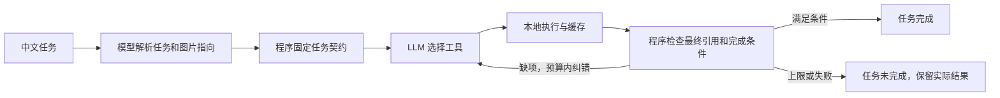

# 第一步优化：任务理解与完成校验

## 为什么先做这一步

此前“结束结果引用了真实证据”与“完成了用户任务”没有对应起来。例如，你要求前后比较，模型只选用已有曝光结果，也可能结束。现在把每轮任务转为一份验收清单，由程序检查清单是否满足。

你仍然用自由中文提问。LLM 负责解析任务与选择工具；完成条件、测量值、目标框和可靠性规则由程序确定。



## 程序到底检查什么

| 任务 | 必须实际存在且被最终报告选用 | 不能据此声称 |
|---|---|---|
| 检查曝光 | 指定图的 `quality:<image_id>` | 已完成目标识别 |
| 只校正曝光 | `correction:original`、校正候选图和实际处理参数 | 校正一定提升识别精度 |
| 识别目标 | 指定图的 `detections:<image_id>`，允许空列表 | 没有候选就代表没有目标 |
| 比较校正前后 | `comparison:original`，并确认原图/校正图质量、检测、校正参数均存在 | 候选增多就代表准确率提高 |
| 解释可靠性结论 | 完整比较结论和实际检索、选用的知识引用 | 引用存在就保证与解释完全相关 |
| 识别校正后的图 | 校正图存在且选用 `detections:corrected` | 原图检测可以替代校正图检测 |

模型的任务解析 JSON 只允许 `task_type`、`image_reference`、`question`。必需证据由 Python 生成并保存在不可变的 TaskContract 中。模型在结束 JSON 中附带另一份契约、分数或“可靠”标签，均不能替换程序事实。

默认分析原图；明确校正图就绑定校正图；“刚才那张”绑定任务开始时的图片状态。已有正确缓存可以直接交付，无需重复计算。缓存直接交付也会更新下一轮图片指向。

曝光单任务不能实际执行检测工具；纯校正需要先测量质量，但不检测目标。错误的图片参数在调用检测器之前拒绝。完整工具对照保留原来的完整流程。

## 现在你怎样操作

1. 双击项目里的 **双击启动.bat**，进入 [对话工作台](http://127.0.0.1:7860/agent)。
2. 重新上传一张图片，或点击 **使用 D 盘示例图**。
3. 保持 **离线工具演示**，输入“只检查这张图的曝光”，点击 **开始分析**。
4. 看结果上方的 **理解的任务、必要结果、任务状态、视觉可靠性**。
5. 输入“只校正这张图的曝光”，查看校正候选与处理参数。
6. 再输入“识别校正后的那张图”，检查图片指向确实为校正图。
7. 输入“比较校正前后，识别有没有改善”，展开 **查看执行过程**，查看任务理解、工具执行、完成校验。

如果尚无校正图却要求检测校正图，系统会返回中文澄清问题。在同一会话回复“先校正原图”，待完成后再要求检测校正图；也可改为分析原图。含条件分支的复杂任务先澄清，指定鱼或珊瑚会说明现有检测器的类别边界。

云端模式会比原流程多一次任务解析调用，计入现有调用预算。本轮只做离线验证；未来选择真实大模型模式会正常使用已配置 API，并产生账户用量。

## 一个能观察的纠错示例

运行：

```powershell
python demo_task_validation.py
```

这个脚本使用预设模型响应、合成图片和检测夹具，刻意模拟一次过早结束。曝光计算和完成校验真实执行，不发起 API 请求，也不评价真实模型精度。

| 步骤 | Action / Observation / 校验 |
|---|---|
| 1 | 解析“比较校正前后”，程序固定要求完整比较证据 |
| 2 | 模型调用曝光评估，获得 `quality:original` |
| 3 | 模型仅提交曝光结果；校验不通过，指出缺少比较、校正图、校正图质量和两图检测 |
| 4 | 具体缺项反馈给模型；模型补齐五个工具调用 |
| 5 | 模型选用 `comparison:original`；校验通过 |

实际示例合计 **5 次模型响应、6 次工具调用、1 次结果纠错**。完整 JSON 保存到 `runs/task_validation_demo.json`。网页正常离线模式采用规则演示，通常会直接补齐工具；过早结束由此脚本专门模拟。

## 状态为什么分开显示

- **任务完成**：报告满足程序固定的已解析任务。
- **任务未完成**：调用失败、缺证据、未选用必要证据或达到运行上限。
- **需要澄清 / 不支持**：尚未进入视觉执行，不交付旧缓存冒充新任务结果。
- **视觉可靠性**：沿用原有图像质量与检测一致性规则。质量失败可以是一次正确完成的比较分析。仅检测输出候选，不给出完整可靠性结论。

结束格式、错误引用、任务理解和完成缺项共用 **最多两次结果纠错**。总预算保持 **10 次模型调用、12 次工具调用、180 秒**；时间在调用返回后检查，保留现有软时间预算，不保证阻塞计算能被立即中断。

## API 与代码位置

`/api/chat` 请求仍使用 `session_id`、`message`、`mode`，新增返回字段：

- `task_contract`：任务类型、图片指向、必要证据和中文要求。
- `task_status`：`completed`、`incomplete`、`needs_clarification`、`unsupported`。
- `task_validation`：`passed` 和具体 `missing`。澄清/不支持的 passed 为 null。
- 旧 `execution_status` 继续说明 API/调度层原因；`vision_status` 保留独立视觉结论。

| 文件 | 职责 |
|---|---|
| [tasks.py](../optical_agent/tasks.py) | 任务解析格式、不可变契约、工具范围和完成验证 |
| [runtime.py](../optical_agent/runtime.py) | 同一预算内的解析、调用、纠错和日志 |
| [reports.py](../optical_agent/reports.py) | 读取实际证据，新增校正参数报告 |
| [state.py](../optical_agent/state.py) | 会话与待澄清原问题 |
| [conversation.js](../static/conversation.js) | 分别展示任务完成与视觉可靠性 |
| [test_tasks.py](../tests/test_tasks.py) | 缺项、错误图片、缓存、澄清和预算回归测试 |

## 这一版的边界

完成校验保证满足**已解析的任务**，不保证自由中文意图解析总是正确。真实云端解析准确率仍需用独立预期任务评测。引用存在也不等于解释与引用完全相关，未来仍需检查引用相关性。此改动不训练检测器，不改变水下质量阈值、数据集和模型权重。
