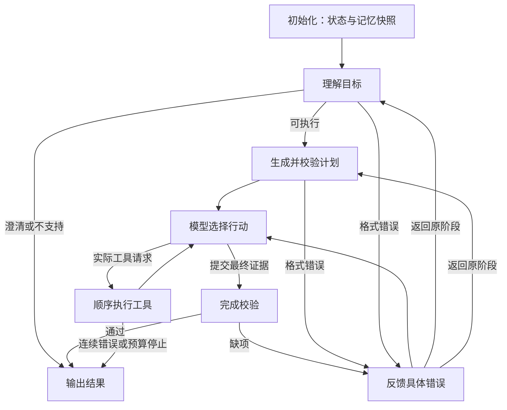

# 0.5.2：native 与 LangGraph 等价对照

## 优化思路

native 用 Python 循环管理任务理解、规划、工具执行和校验。新运行器用真实 LangGraph `StateGraph` 管理这些阶段：节点执行动作，条件边决定下一步。

两个运行器调用相同的目标解析、提示、视觉工具、RAG、完成验证器和可靠性规则。native 调度源文件保持不变。LangGraph 版本的节点中实际调用模型或工具，网页记录的是经过的节点。

框架让执行结构更明确、便于观察分支和纠错；视觉识别精度仍取决于图片、检测器与可靠性规则。本次没有付费 API 请求，离线演示使用规则回复和预设回复，不能作为真实 LLM 能力的证据。



预算在每次模型调用和工具执行前检查，保留10次模型调用、12次工具调用、180秒检查预算；格式和完成纠错共用两次额度，重新规划仍受原有工具规则约束。图步骤上限100是额外保护。已开始的同步视觉计算不强行中断。

## 怎样操作

1. 双击项目中的 **LangGraph对照启动.bat**，打开 `http://127.0.0.1:7860/agent`。原来的双击启动入口也会优先使用已建立的 D 盘隔离环境。
2. 选择“离线工具演示”，在“运行器”中选择 **LangGraph（等价对照）**，调度方式使用动态调度。网页默认仍是 native。
3. 点击 D 盘示例，选择正常、模拟偏暗或模拟信息丢失图片，提交：

   > 检查这张水下图，必要时校正曝光，然后只识别管道，说明结果是否可靠。

4. 展开“图节点执行记录”和“查看执行过程”。前者展示节点与分支，后者展示实际工具及证据。计划文字不等于动作已执行。
5. 若要和 native 比较，点击“更换图片 / 新建会话”，使用同一图片重新分析。会话首次执行后固定运行器，防止混用缓存和追问状态。

云端模式复用现有 DeepSeek 配置，会消耗 API 用量；本次交付只验证离线模式。若当前服务使用未安装依赖的基础 Python，页面会显示依赖不可用；关闭本项目的旧服务窗口后，再双击对照入口。

## 可观察的纠错示例

执行以下离线演示会同时生成一个预设回复案例：

```powershell
& 'D:\CodexData\optical_agent\langgraph\venv\Scripts\python.exe' demo_langgraph.py --real-images
```

执行记录：理解“只检查曝光” → 生成计划 → 模型提前提交 `quality:original` → 验证器发现该证据尚不存在 → 纠错 → 调用曝光评估工具 → 再次提交真实证据 → 校验通过。

该案例实际运行图与工具，但模型回复是离线预设。结果保存于 `D:\CodexData\optical_agent\langgraph\runs`。三种 SODD 输入使用测试索引6—8；偏暗和全黑输入是模拟扰动。

## state、会话与长期记忆

| 数据 | 生命周期 |
|---|---|
| GraphState | 本轮控制字段：目标、阶段、计数、证据编号 |
| 本地运行上下文 | 图片、客户端、视觉缓存、记忆快照；不导出完整图状态 |
| 图片会话 | 沿用30分钟闲置过期，不恢复旧图片 |
| SQLite长期记忆 | 沿用0.5.1偏好与最近200条摘要；通过完成校验才保存 |

第一版没有图检查点恢复，也没有增加新的长期记忆数据库。历史只帮助规划，不能充当当前图片证据。节点日志脱敏，LangSmith云端追踪关闭。

## 依赖与接口

本机隔离环境：`D:\CodexData\optical_agent\langgraph\venv`，继承原环境视觉库。基础环境没有安装 LangGraph；原 Torch、Transformers 和模型权重未改动。安装时发现继承环境的 Pydantic v1兼容模块缺失，只在隔离环境补齐同版本 Pydantic 2.10.6。其他 LangGraph 依赖锁定于 `requirements-langgraph.txt`。

在其他电脑上，先准备项目视觉环境，再创建继承它的虚拟环境并安装锁定依赖；当前电脑已经准备好，无需再次安装。

`POST /api/chat` 新增可选 `runtime_engine`：`native`（缺省）或 `langgraph`。LangGraph仅支持 `agent_mode=adaptive`。请求与既有结果字段保持兼容，新增 `runtime_engine` 和 `graph_trace`。跨运行器复用同一会话会返回中文错误，需要新建会话。

直接调用 `LangGraphRuntime(client).run(session, message)` 与现有运行器接口一致，默认不启用长期记忆；网页沿用既有记忆设置。LangGraph依赖延迟导入，缺依赖时 native 仍可使用。

官方来源：[Graph API](https://docs.langchain.com/oss/python/langgraph/graph-api)、[LangGraph 1.2.12](https://pypi.org/project/langgraph/1.2.12/)。

结果见项目根目录 `LANGGRAPH_RESULTS.md` 与 `LANGGRAPH_RESULTS.json`。旧正式 Agent Eval、RAG 和视觉报告继续保留。
