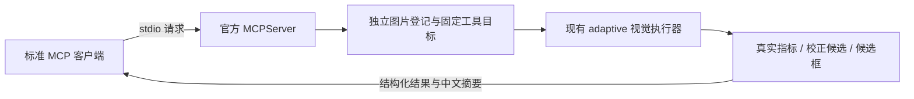

# 0.5.3：三个视觉工具的本地 MCP 服务

## 这次增加了什么

MCP 是工具的标准连接方式。现有 native / LangGraph 运行器仍负责理解任务、选择动作和校验完成条件；本次增加一个独立进程，让标准 MCP 客户端也能发现、调用视觉工具。



本轮没有配置 Codex 连接，没有改动原 Agent 的工具后端，不使用 DeepSeek、Embedding 或其他付费 API，不写个人长期记忆。SDK 固定为官方 `mcp==2.3.0`，采用 v2 的 `MCPServer`。[官方 SDK](https://pypi.org/project/mcp/2.3.0/)、[服务工具说明](https://py.sdk.modelcontextprotocol.io/servers/tools/)

## 最简单的操作

1. 打开项目文件夹，双击 **MCP离线调用示例.bat**。
2. 窗口先显示“已初始化 MCP 子进程，发现……”及三个工具名称。
3. 等待曝光、校正、检测结果返回。第一次需要加载本地检测模型，速度会较慢。
4. 最后看到一致性检查结果与候选图片路径。复制路径到资源管理器即可查看图片。
5. 完整记录在 `D:\CodexData\optical_agent\mcp\runs\demo_v053.json`，服务摘要日志在 `D:\CodexData\optical_agent\mcp\logs\server.log`。

示例会启动真实服务子进程，通过标准客户端执行 initialize、tools/list、tools/call；完成后退出服务。它不是直接调用 Python 函数后冒充协议演示。示例使用现有 SODD 测试索引 6，不下载数据。

MCP 服务通过输入、输出管道通信，没有网页地址或新的端口；`http://127.0.0.1:7860/agent` 继续是原 Agent 网页。单独双击服务入口会等待协议请求，使用客户端示例更容易观察。

## 工具及调用参数

| 工具 | 参数示例 | 结果及边界 |
|---|---|---|
| `assess_image_quality` | `{"image_path":"D:\\CodexData\\optical_agent\\...\\photo.jpg"}` 或 `{"image_id":"img_..."}` | 实际指标、质量状态、热图路径；二者只能选一 |
| `generate_exposure_candidate` | `{"image_id":"img_原图编号","method":"gamma_only"}` | 候选编号、处理参数、路径、是否实际调整 |
| `detect_objects` | `{"image_id":"img_...","target_classes":["管道"]}` | 程序过滤后的候选框、数量、分数、模型与校准说明 |

两种候选方法为 `gamma_only` 和 `local_bounded`。必须先评估原图质量；仅从原图生成，每种一次，重复请求复用。正常曝光返回未调整候选；严重信息丢失或不可评估时拒绝校正。候选可继续评估、检测，不能再生成增强候选。

检测类别：`propeller`、`pipe_type2`、`red_fin`、`net`、`qr_codes`、`pipe`。省略 `target_classes` 检测全部；“管道”包含 `pipe` / `pipe_type2`，“二维码”对应 `qr_codes`。其他类别（包括实验机器人分支）明确返回不支持，不能静默删去。

三个工具**不提供完整可靠性验收**。检测结果始终是 `candidate_only`；曝光质量通过也不能证明目标识别可靠。数量或分数上升不代表识别精度提高。

## 看懂一次实际调用

下面是流程示意，图片编号必须使用该次服务返回的值：

1. `assess_image_quality(image_path=...)` → 原图编号 A、质量指标与热图。
2. `generate_exposure_candidate(image_id=A, method="gamma_only")` → 候选编号 B 和参数。
3. `assess_image_quality(image_id=B)` → 候选质量指标。
4. `detect_objects(image_id=A)` 与 `detect_objects(image_id=B)` → 两张图各自的候选框。
5. 再调用原图评估、相同候选生成和原图检测 → `cached=true`，不重复视觉计算。

统一结果包含 `ok`、`tool`、`summary`、`data`、`cached`、`elapsed_ms`。失败返回 `error.category` / `error.message`，协议的 `isError` 同时为 true。`structuredContent` 给程序使用，文本内容供客户端阅读；本版没有图片资源传输，查看图片使用返回的本地路径。

## 图片与缓存规则

- 输入限于 `D:\CodexData\optical_agent` 内的绝对路径；解析符号链接/目录联接后仍须在此目录内。
- 文件上限 32 MiB、1600 万像素；单帧、至少 8×8，支持 JPEG / PNG / BMP / TIFF / WebP。与当前项目相同地解码为 RGB，不隐式缩放。
- 原图只读。图片编号是不透明的 `img_...`，不能使用网页中的 `original`。
- 相同文件字节重复登记复用上下文；候选归属于原图上下文。每个上下文加锁，服务进程内的 GPU 推理串行执行。
- 闲置 30 分钟失效；最多 20 个原图上下文，优先释放闲置的最旧上下文。正在执行或排队的调用不会被清除。
- 退出、重启服务后旧编号失效；重新登记即可。生成文件和日志仍在 D 盘，不恢复旧会话或长期记忆。
- 输入文件由你管理；外部修改不会改变已登记的只读像素。重新登记修改后的文件会建立新上下文，结果提供像素哈希便于核对。

## 常见错误

| 分类 | 含义与处理 |
|---|---|
| `parameters` | 参数字段、类型或二选一规则错误；按工具示例修改 |
| `invalid_path` / `invalid_image` | 路径越界、图片不可读或不可解码 |
| `size_limit` / `pixel_limit` | 超过文件或像素上限 |
| `unknown_image` | 过期、容量释放或服务已重启；重新登记 |
| `prerequisite` | 未评估原图，或尝试增强候选 |
| `quality_failure` | 原图丢失信息或不可评估，停止恢复 |
| `unsupported_class` | 当前六类不支持该目标 |
| `model_unavailable` | 检测权重缺失，不能解释为“没有目标” |
| `computation` / `storage` | 计算或结果文件写入失败；原图保留 |
| `capacity` | 全部上下文正在使用，稍后重试 |

## 环境与客户端模板

当前机器已创建隔离环境：`D:\CodexData\optical_agent\mcp\venv`，继承原视觉依赖，MCP 的新增依赖安装在此环境。Torch、TorchVision、Transformers 版本保持不变。安装清单是 `requirements-mcp.txt`，实际版本记录是 `requirements-mcp-lock.txt`。

重建环境时，使用已有视觉 Python 创建 `--system-site-packages` 环境，再在该环境安装依赖；设置下载缓存与临时目录到 D 盘。无需在原环境安装 MCP。

运行自己的本地图片：

```powershell
& 'D:\CodexData\optical_agent\mcp\venv\Scripts\python.exe' -u -X utf8 -B demo_mcp.py --image 'D:\CodexData\optical_agent\你的图片.jpg' --method local_bounded
```

默认示例要求可评估、适合候选流程的输入；若图像质量失败，程序会明确停止而非假装生成候选。此时可直接使用 MCP 的曝光工具检查失败原因。

`mcp-client.example.json` 是常见客户端配置模板，将 `C:\REPLACE_WITH_PROJECT_PATH` 换成实际项目绝对路径。不同客户端的配置位置自行规定，本轮未向任何客户端自动写入配置。模板不需要 API 密钥。

服务使用 `stderr` 日志，`stdout` 仅供协议消息；已验证第三方普通打印也不会污染协议。日志先脱敏，只记录工具、编号、缓存、错误分类和耗时摘要。[官方 stdio 说明](https://modelcontextprotocol.io/docs/develop/build-server)

## 验证范围

见 [MCP 验证报告](../MCP_RESULTS.md)。结果说明协议接入与现有计算一致，不代表真实 LLM 的工具选择能力或视觉精度提升。native、LangGraph、RAG、长期记忆以及旧正式评测入口保留。
