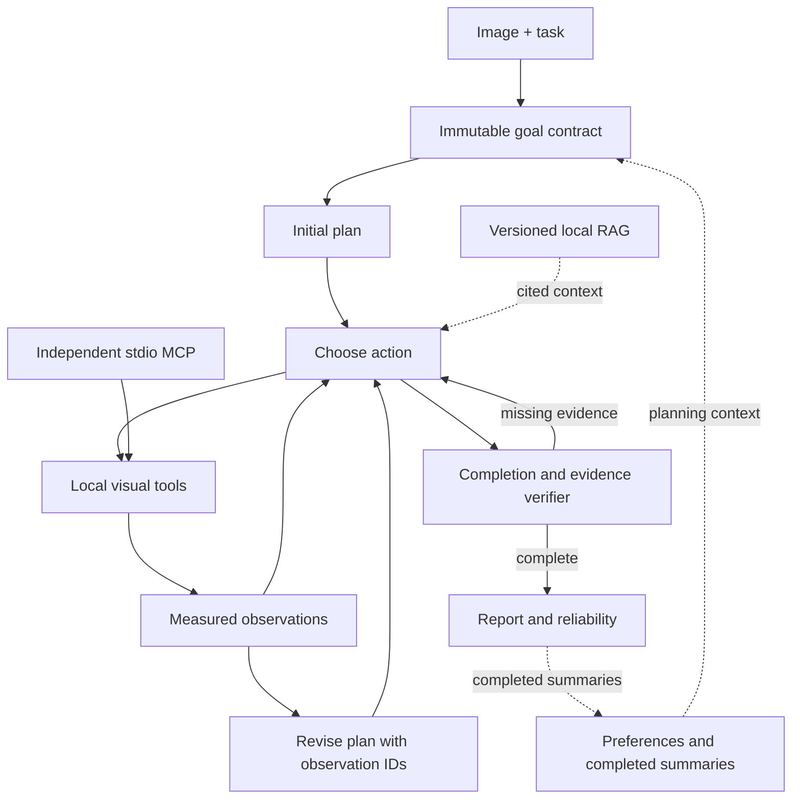

# Architecture and capability map / 架构与功能清单

The supported daily flow is image → task → measured result. Advanced controls expose experiments without changing default behavior.

## Execution engines

Native retains its explicit Python loop. LangGraph retains actual StateGraph nodes and graph-specific stops. Both use shared turn initialization, request building, model accounting, tool-observation processing and final report construction. Repair messages and control flow retain their original engine behavior.

The limits remain 10 model calls, 12 tools and 180 seconds checked at execution boundaries; format/completion repairs share two attempts. LangGraph additionally limits graph steps. Model requests, successful responses, actual HTTP attempts and graph nodes remain separate counts.

Images and vision caches stay in local contexts. The session lock is released on exit. Completed memory is saved once; history and RAG do not become current-image evidence. Optional dependencies are loaded only when selected.

## Capability map

| Capability | Supported entry | Boundary |
|---|---|---|
| Exposure assessment | Image page, chat, MCP | Actual metrics and heatmap |
| Bounded correction | Image page, chat, MCP | Original-only candidates; no lost-texture claim |
| Target candidates and reliability | Chat, image analysis | Missing model is unavailable; candidate scores require checks |
| Adaptive goals and replanning | Native; optional LangGraph | Immutable goal, actual observations, budget |
| RAG | Chat; knowledge page | Actual retrieved citations; versioned corpus |
| Long-term memory | Chat; memory page | Preferences and summaries; no old-image evidence |
| MCP | `serve_mcp.py` | Exactly three tools; separate registry |
| Training and evaluations | Unified experiment commands | Explicit execution; original arguments; frozen artifacts |

See [command migration](CLI_MIGRATION.md), [verification](SIMPLIFICATION.md) and [historical reports](reports/README.md). Historical experiments require their frozen code and corpus; this refactor does not relabel old results as current acceptance.
